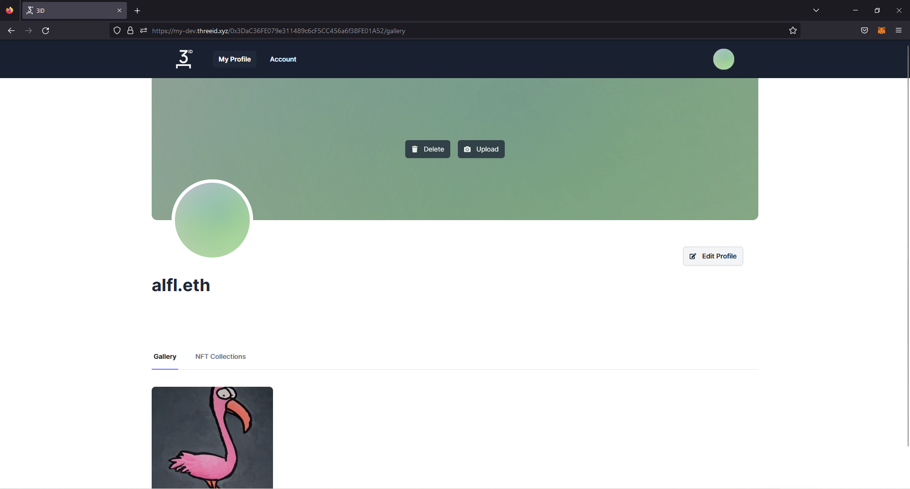
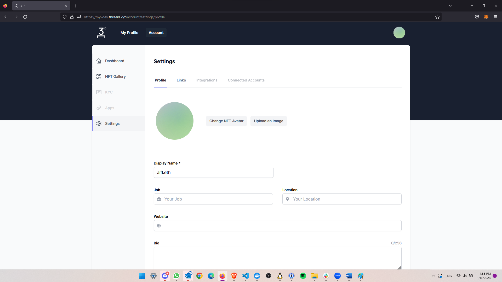
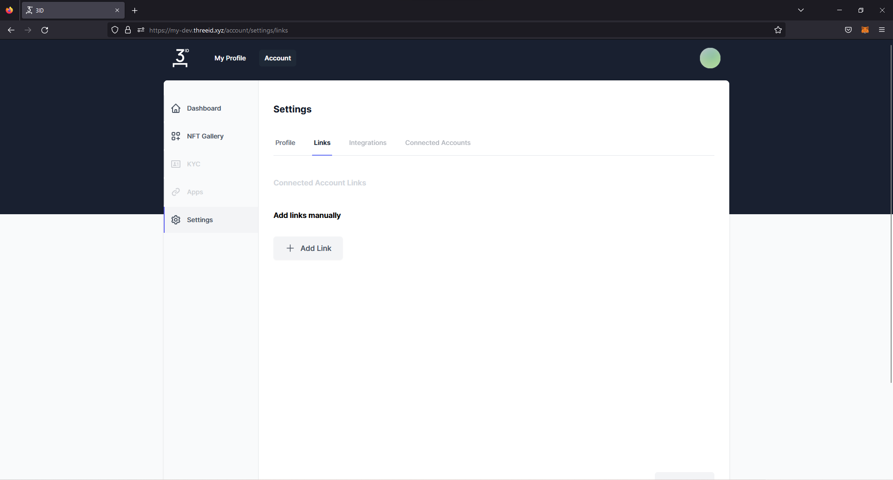
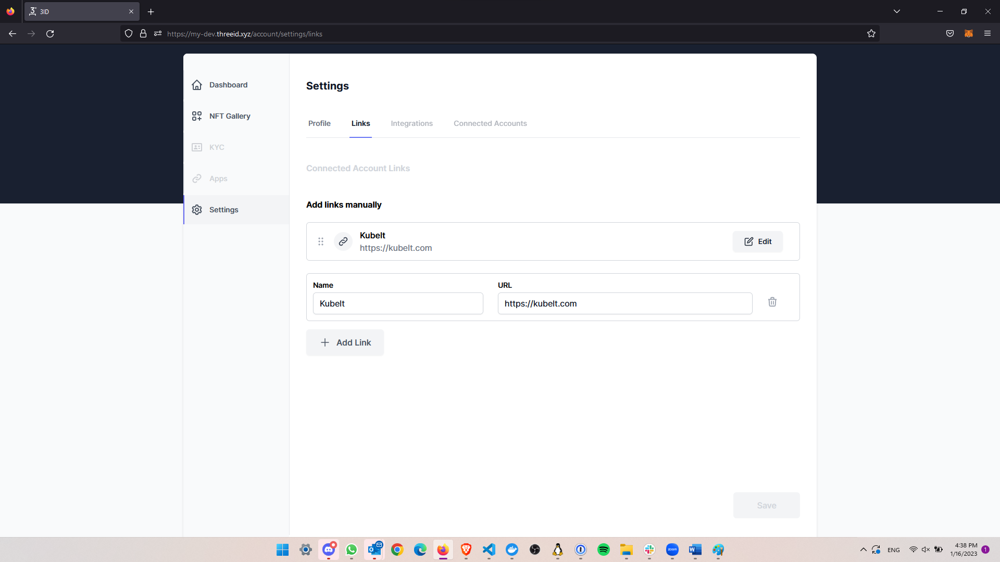

# Setting up your profile

This a getting started guide for personal profiles. [Developer instructions are here.](./app-setup.md)

## Passport Login

Log in to the application and select **My 3ID** to manage your profile.

## Account Dashboard

From the account dashboard you'll be able to configure your profile settings, NFT gallery, and quick links.

## Select "My Profile"

In the top-left of the screen select **My Profile**. On the profile screen you can:

* Set your **cover photo**,
* View your **gallery**,
* View your **NFT collections**, and
* **Edit your profile.**

If you share the link to this page with other people they will be able to view the information you've entered.

## Select "Edit Profile"

In the top-right of the profile screen select **Edit Profile**. This will take you to the account settings page. Here you can:

* Change your **NFT Avatar** or upload a custom image.
* Enter a **Display Name**, **Job**, **Location**, **website**, and **bio**.

This information is shared with people through the link to your profile and with permissioned applications through the [Profile API](../profile/reference.md).

## Select "Links"

Let's add a link to our public profile page. In the tabs at the top of the page, select "Links".

## Add a Link

Click **+ Add Link**, enter the information for a link, and hit _enter_ or select **Save**.

