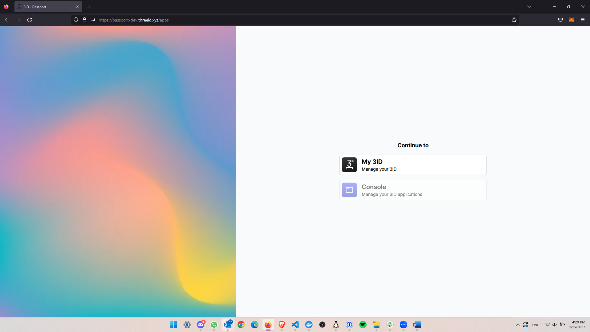
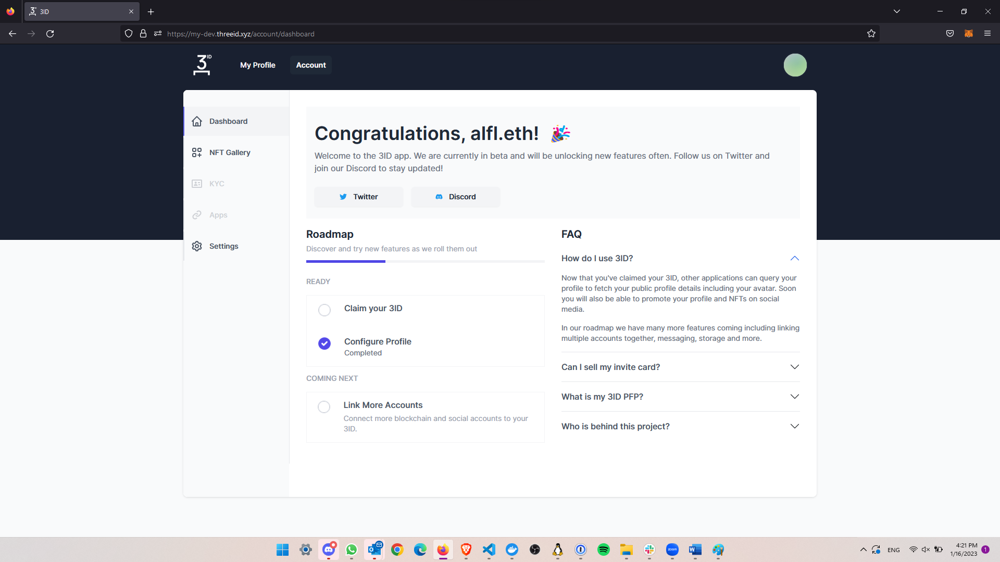
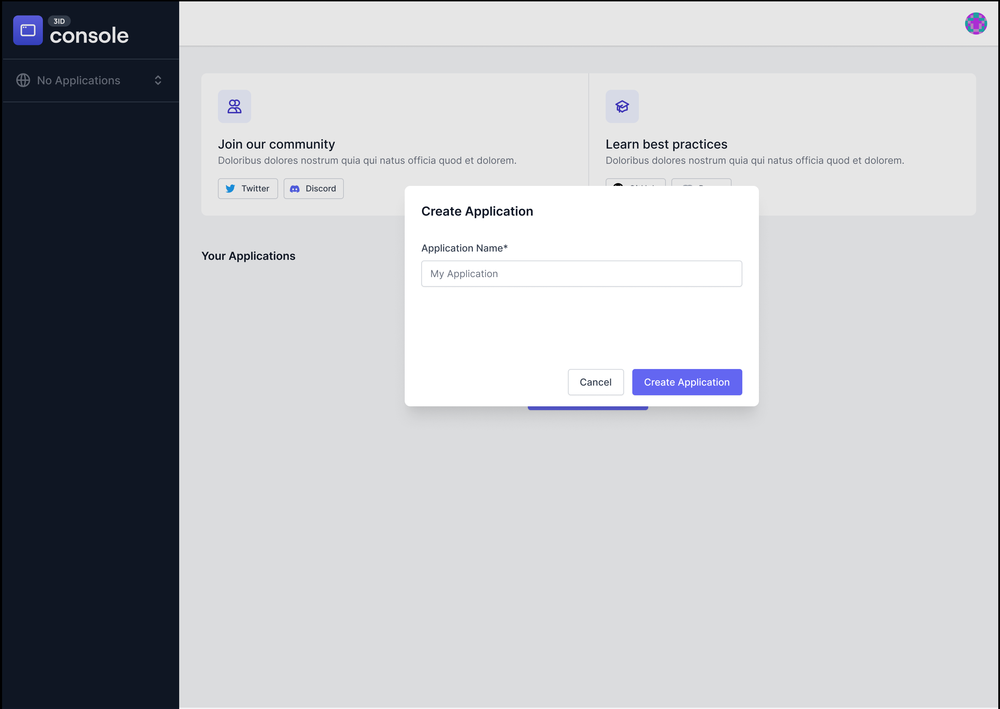
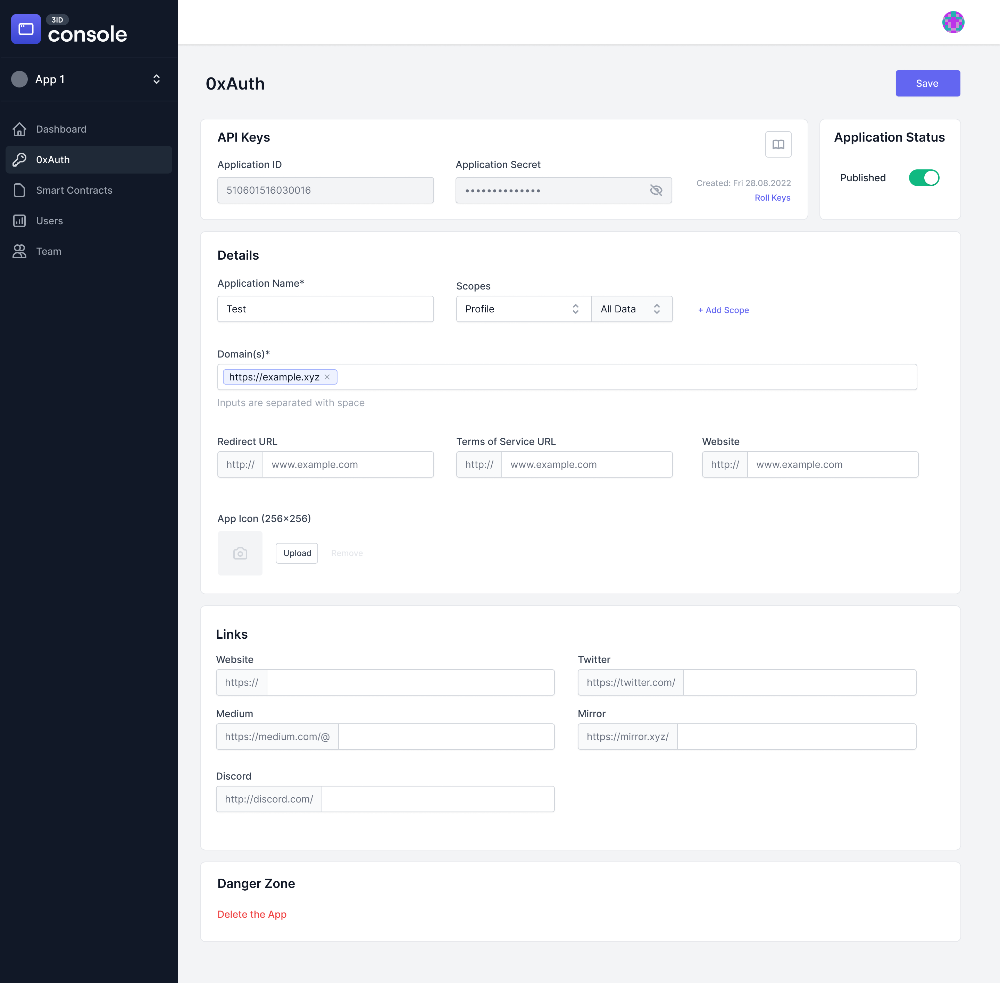

# Setting up your profile

This a getting started guide for personal profiles. [Developer instructions are here.](./app-setup.md)

## Passport Login

When you first login you'll be presented with a selection of applications. Select **My 3ID** to manage your profile.

## Connect with 3ID Passport

First, connect with 3ID Passport: [https://passport.threeid.xyz](https://passport.threeid.xyz). You’ll see a screen like this:

## Select Console

Console is where you’ll create and configure your 3ID Application. Select Console and you’ll see your list of applications — 

## Click “Create Application”

— but you don’t have one yet! Click the big “Create Application” button in the middle of the screen and you’ll be taken to the dashboard for a new application.

## Open 0xAuth Settings

Click the second item in the sidebar on the left, **0xAuth**. This will open the authorization configuration settings for your 3ID application. If you’ve configured an OAuth application before, 0xAuth configuration should look familiar:

## Configure Your Application Data

Now you can configure your application data. [See the Console Reference](../console/reference.md) for more information.
