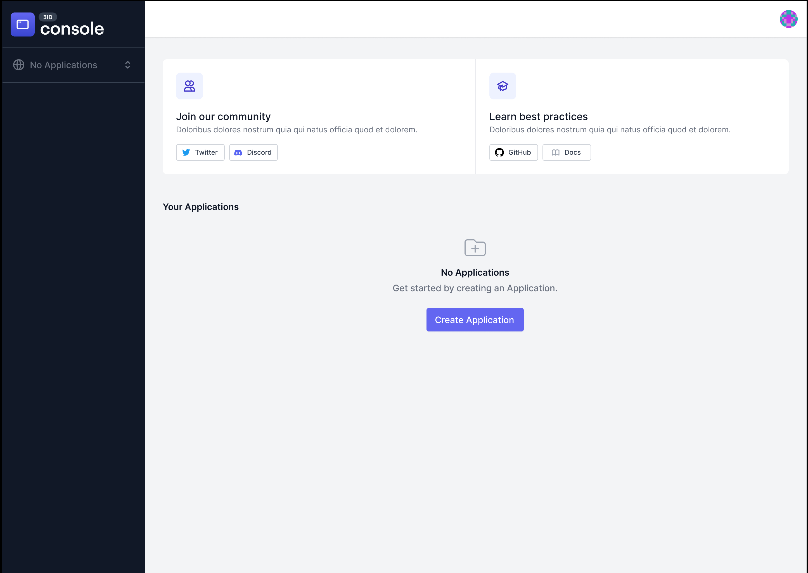

# Getting Started With 3ID

## Connect with 3ID Passport

First, connect with 3ID Passport: [https://passport.threeid.xyz](https://passport.threeid.xyz). You’ll see a screen like this:

## Select Console

Console is where you’ll create and configure your 3ID Application. Select Console and you’ll see your list of applications — 

## Click “Create Application”

— but you don’t have one yet! Click the big “Create Application” button in the middle of the screen and you’ll be taken to the dashboard for a new application.

## Open 0xAuth Settings

Click the second item in the sidebar on the left, **0xAuth**. This will open the authorization configuration settings for your 3ID application. If you’ve configured an OAuth application before, 0xAuth configuration should look familiar:

## Configure Your Application Data

TODO: More here.

- Name
- Requested authorization scopes
- Custom domains and white-labelling configuration
- Post-login redirect URL
- Publish and Save
