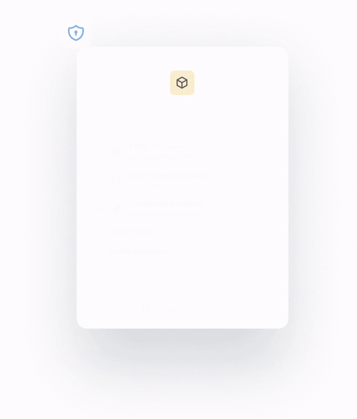

# Setup Auth Flow


For this step you will need the **Client ID** and the **Client Secret** from the [previous step](create-an-application.md).


The Rollup ID authentication flow is built upon the [OpenID Connect (OIDC) protocol](https://openid.net/developers/how-connect-works/), ensuring a secure and standardized process. This guide will walk you through the steps involved in this flow.

For this step, since Rollup ID is **standards-compliant,** you can use off-the-shelf [open-source libraries](https://oauth.net/code/) to build your OAuth flow.


Many open source OAuth client libraries like [Auth.js](https://authjs.dev/) will automatically create the necessary routes and manage client state and requests for your application that you wil see below.

We have created a reference implementation using [Remix](https://remix.run/) and the [Remix OAuth](https://github.com/sergiodxa/remix-auth) library [here](https://github.com/proofzero/rollupid/tree/main/apps/profile/app/routes/auth) which we will refer to several times in this step.


### Step 1: Initiate the Auth Request

To log in or register to a user your application the first step is to send an authorization request to your Rollup ID application. This is typically handled by a redirect route (e.g.`/auth`) in your application.&#x20;

This request contains essential parameters, including the `client_id` (your application's ID), `response_type`, `scope`, `state` and `redirect_url`.&#x20;

The `state` parameter is a CSRF token used to protect against potential attacks and to maintain any state that might be useful after the authentication process (more on this later). Before redirecting users to the Rollup ID auth flow, it is important that the state parameter is persisted in a cookie or other storage method for reference in a later step.

For example, your authorization URL should look like this: `https://passport.rollup.id/authorize?client_id=<your_app_id>&state=<generated_state>&scope=email`.


For PRO apps, [custom hostnames](../platform/console/custom-domain.md) are allowed and would replace `passport.rollup.id` with your domain name and more customization features would be available in the [designer](../platform/console/designer.md).


### Step 2: User Authentication & Authorization

Rollup ID will use the provided `client_id` to look up your application details, displaying your application name and branding information.

If the user is not signed in they will be displayed the authentication page where they can choose from various authentication methods. After successful authentication, the user will be shown the authorization screen to provide consent for the requested scopes, allowing your application to access specific data.

Upon completion, users will be redirected back to your app using the `redirect_url` set in the previous step.


<figure><figcaption></figcaption></figure>

### Step 3: **Authorization Code Exchange**

Your `redirect_url` should be ready to accept an exchange token and state parameters in the following format:

```
// https://<redirect_url>?code=<exchange code>&state=<state>
```

* **Code**: the exchange code needed request an access token
* **State:** this state should match the state you created for the user/client in Step 1. _Typically your chosen OAuth library will manage this for you._
* **Redirect URL**: the redirect url set in your app in the [previous step](create-an-application.md). _For development, "localhost" is an accepted redirect url host._

To exchange the code for an access token use this information to call the exchange token endpoint  using the "authorization\_code" value for "grant\_type"

### Step 4: Access Token & ID Token

With the obtained access token, your application can now fetch the [id token](../advanced/tokens.md#id-tokens) from the Rollup ID `/userinfo`[endpoint](../reference/passport-api.md#user-info) to fetch or any authorized endpoint from the [Galaxy API](../reference/galaxy-api.md).


Inside the ID token object you will find a unique claim called `sub` which will be consistent across all logins. This will match the value of the `sub` claim in access and refresh tokens also.


Ensure you handle this data with care, respecting user privacy and adhering to data protection regulations.

### Step 5: Refresh Tokens (optional)

Access tokens are valid for 1 hour, with the expiry time stored in the "exp" property in the JWT. If your application requires prolonged access to user data without prompting the user for re-authentication, consider implementing refresh tokens using the [exchange token endpoint](../reference/passport-api.md#exchange-token).&#x20;

Refresh tokens allow your application to obtain new access tokens, ensuring uninterrupted access to user data.

If you ever find yourself with an expired refresh token you can consider this as the user being "logged out" and redirect them to repeat the auth flow.
