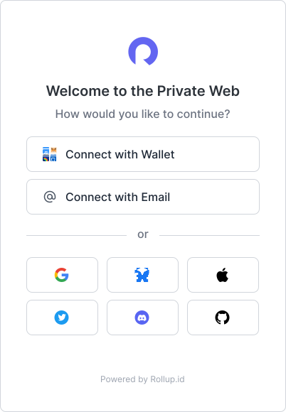
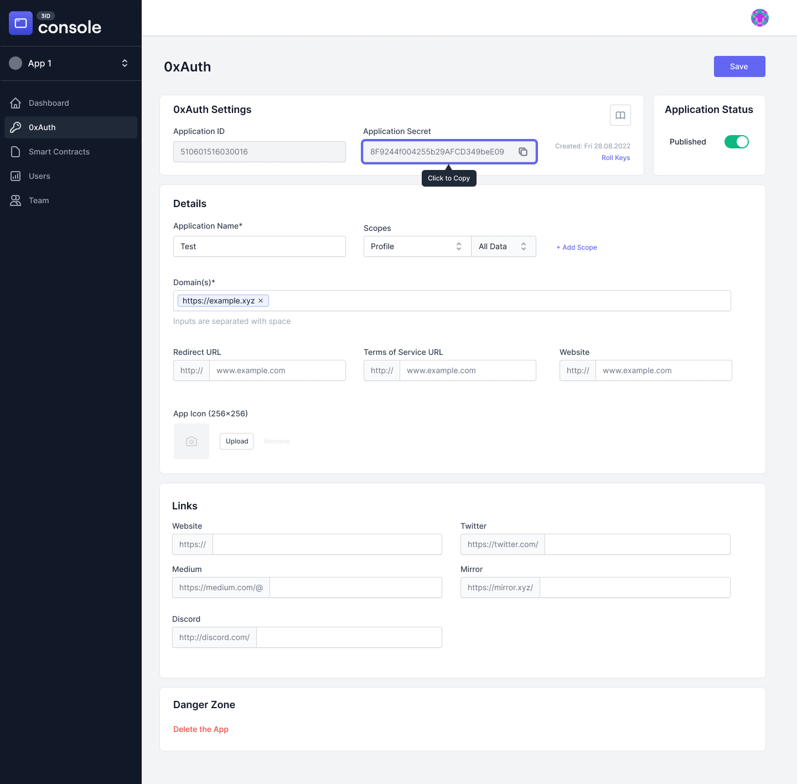

# Create an application

### Step 1: Connect with Rollup Passport

First, login to [Console](../platform/console.md) with Rollup Passport by visiting [https://passport.rollup.id](https://passport.rollup.id) where you will see a screen like this where you can choose your favorite authentication method to register / login with:

<figure><figcaption>
Rollup Passport Authentication
</figcaption></figure>

### Step 2: Create an App

After logging in you will be redirected to the [Console](../platform/console.md) dashboard. This is where you’ll register and configure your Rollup Application.

<figure><figcaption></figcaption></figure>

 

<figure><figcaption></figcaption></figure>

From here you will want to click the  “Create Application” button in the middle of the screen where you will be prompted to give your application a name and finally redirected to your new application's configuration screen.

### Step 3: Configure your Application

Once the app is created, the first screen you will see is your application dashboard. This is where you can copy your [Galaxy API key](../reference/galaxy-api.md) and your application keys. **Please copy the application secret and store it somewhere secure.**&#x20;


The application secret is only shared once so, if you missed it you can click the "roll keys" link to regenerate the keys.


<figure><figcaption></figcaption></figure>

 

<figure><figcaption></figcaption></figure>

Next click the "OAuth" link on the left navigation bar to view the full application configuration screen.

<figure><figcaption></figcaption></figure>

Here you will see the standard [OAuth 2.0](https://oauth.net/2/) configuration form where you will need to set the following required fields:

* **Redirect URL**: The address where Rollup will redirect your users to after they have completed the auth flow ([more on next page](auth-flow.md))
* **App Icon**: The logo of your application you want displayed to users during the auth flow ([see passport for more](../platform/passport.md))
* **Terms of Service URL**: A link to your application's TOS
* **Website**: A link to your application's website
* **Scopes**: \[coming soon]
* **Domains**: \[coming soon]


In most cases you will need to setup an app for each environment and save the correct **redirect url** for each. For example, a "localhost" redirect url for local development and a "staging" redirect url for test environments.


All other fields are optional. Once complete click the "Published" toggle and "Save" button.

Now that you have a fully configured application you can complete the integration.
