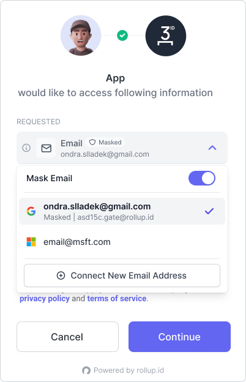

# Requesting Email

This guide will walk you through how to request email addresses from your user using the Email [Scope](../reference/scopes.md).

### Step 1

In your application OAuth configuration make sure that email is selected in the "allowed scopes" dropdown. Make sure to save this configuration before moving to step 2.

<figure><figcaption>
Email Scope Dropdown
</figcaption></figure>

### Step 2

When [logging in users](../getting-started/auth-flow.md) make sure you add `email` to the `scope` query param. Your auth url should look something like this `https://<rollup.id or your custom domain>/authorize?client_id=xxx&state=xxx&scope=email`

### Step 3

After authenticating into your custom Rollup application, your users will we be presented with an authorization screen containing the email scope authorization request.

If the user already as a connected email, this email will be automatically selected. If no email address is connected to their identity they can connect an new email address and continue.&#x20;

<figure><figcaption>
Email Authorization
</figcaption></figure>

### Step 4

When redirected back to your application, the [access token](../advanced/tokens.md) will now contain an authorization for email address. The email address will also be available returned in the user token via the [user info endpoint](../reference/passport-api.md#user-info).
