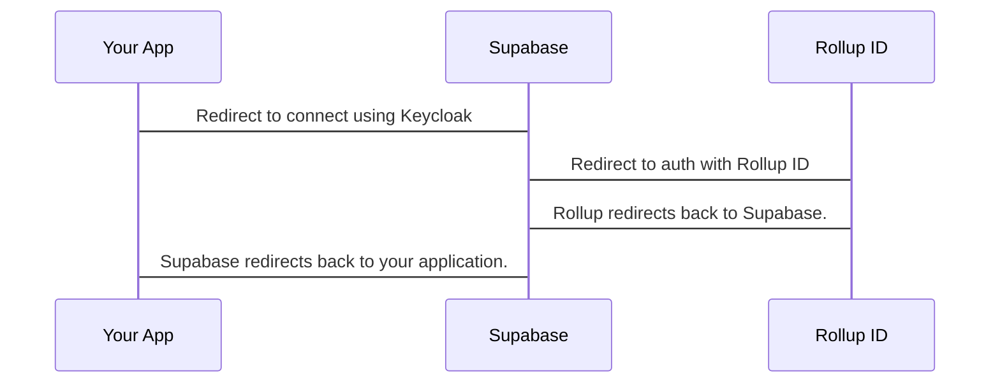
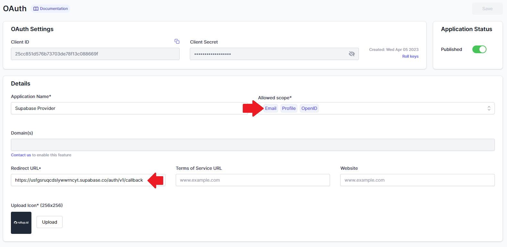
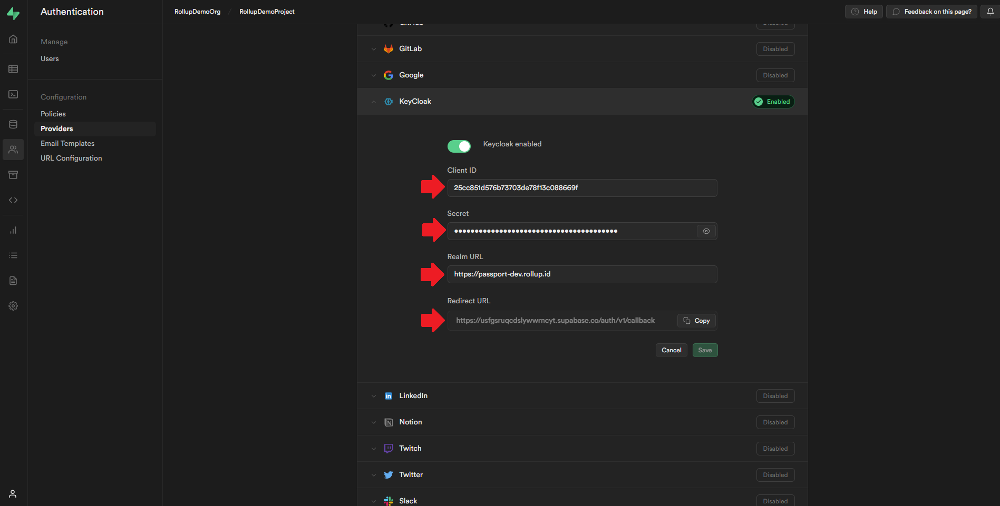

# Overview

Rollup implements the Keycloak interface for authentication and authorization with Supabase. This involves multiple redirects:



In order to implement these hops, configure Rollup, Supabase, and your app as follows:

# Console Configuration

Request authorization for the `Email` scope and set the Redirect URL to the Supabase Keycloak provider's redirect URL. You can get the redirect URL from the Keycloak provider configuration (see below).

<figure><figcaption><p>Rollup Console Configuration for the Supabase callback and required scope.</p></figcaption></figure>

Save and publish your application.

# Supabase Configuration

Within Supabase, select "Authentication" and then under "Configuration" select "Providers" and open "Keycloak".

Update your Keycloak configuration's Client ID and secret with the values from your Rollup Console Application.

Set your Keycloak Realm to `https://passport.rollup.id` (the screenshot below shows our development environment).

Copy your callback URL here and use it in your Rollup Console Application configuration (see above).

<figure><figcaption><p></p></figcaption></figure>

Save your settings.

# App Configuration

Within your application, use the Supabase library to sign the user in with the configured Keycloak provider:

```javascript
const { createClient } = supabase // This comes from another import or script tag load.
const Supabase = createClient('YOUR_SUPABASE_APP_URL', 'YOUR_SUPABASE_PUBLIC_API_KEY')
const { data, error } = await Supabase.auth.signInWithOAuth({
  provider: 'keycloak',
  options: {
    redirectTo: 'https://YOUR_APP_REDIRECT_URL'
  },
})
```
