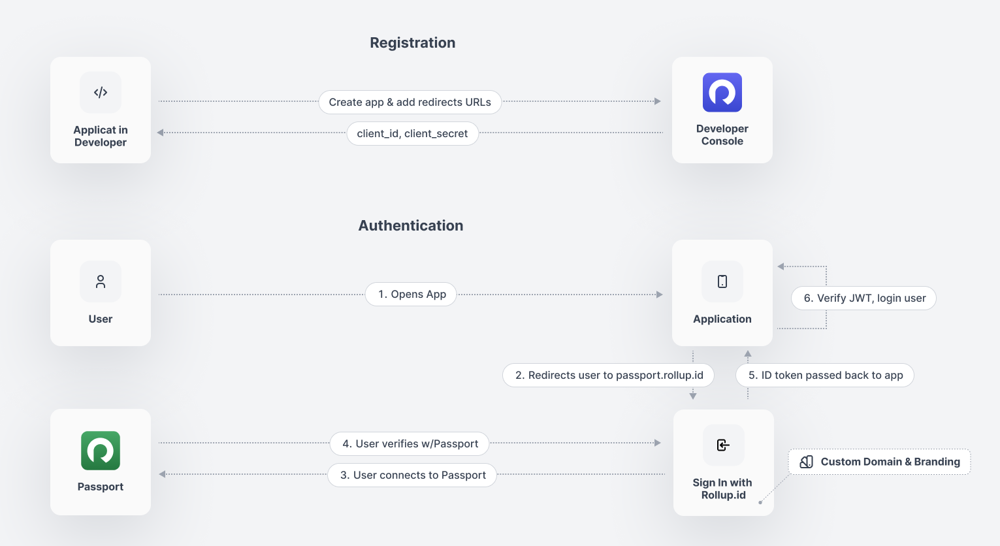

# Using Smart Contract Wallets

## Accessing You User's Smart Contract Wallets

With Rollup your can request access to your users [ERC 4337](https://eips.ethereum.org/EIPS/eip-4337) smart contract wallets. If they don't have a smart contract wallet, no sweat, we will help them create one when they onboard to your application. The following will guide you through setting up this flow.

##### Currently for this feature we only support ethereum and polygon with their testnets. [Contact us](https://discord.com/invite/rollupid) if you'd like to add something else.

### Prerequisites

- Setup an application with one of our supported[ paymaster providers](../platform/console/blockchain.md#preferred-paymasters).

### Setup

1. Login into [Console](https://console.rollup.id)
2. Go to your app (if you don't have one, [set one up](../getting-started/create-an-application.md))
3. Go to the Blockchain setting tab
4. In the paymaster section, enter your paymaster credential and save.
5. Go to the OAuth settings tab
6. In the scopes dropdown select `erc_4337` scope
7. Update your application to include the `erc_4337` scope in the [authorization request](../getting-started/auth-flow.md)

<figure><figcaption></figcaption></figure>

### Registering Session Keys

When your users login to your application you will now be presented with an access [token](../advanced/tokens.md) that contains the `erc_4337` claim and a list of smart contract wallet addresses and a nickname. For example:

```json
{
  "sub": "<unique did urn>",
  "aud": "<your app urn>",
  "erc_4337": [{
    "nickname": "game wallet",
    "address": "0x123abc...."
  }],
  ...
}
```

<figure><figcaption></figcaption></figure>

With this access token you can now make requests to the [galaxy-api.md](../reference/galaxy-api.md 'mention') to register your [session key](https://twitter.com/chainlink/status/1636781219848372235). To register a session key you will always need to generate a ethers wallet and send the public address along with the specified smart contract wallet to register. For example:

````typescript
import { Wallet } from 'ethers'

// if using more than once we recommend that you store the private key somewhere safe.
// you will need the privateSigner to submit transactions using your session key.
const privateSigner = Wallet.createRandom()
const address = await privateSigner.address()

const sessionDataRes = await fetch("https://galaxy.rollup.id/rest/register-session-key", {
  method: "POST",
  headers: {
    "Content-Type": "application/json",
    Authorization: `Bearer ${accessToken}`,
    "X-GALAXY-KEY": process.env.ROLLUP_GALAXY_API_KEY!, // available in console app
  },
  body: JSON.stringify({
      smartContractWalletAddress: session.erc_4337[0].address, //users' smart contract wallet address
      sessionPublicKey: address, //ethereum address for which to issue session key
    },
  }),
})

const sessionData = await sessionDataRes.json()

```
````

Once a session key has been registered you should receive session key data that can be used directly with your ethers library or account abstraction / paymaster provider SDK directly.


When registering a session key we will use your configured paymaster provider and their tools to fulfill the registration. **Please ensure the API keys saved in your paymaster settings are the same you use in your application's transactions.**


### Revocation of Session Key

Once user authorized app to create a session key for provided wallet, user easily can revoke this session key at any time.

Here's how to do that:

1. Go to [Passport](https://passport.rollup.id)
2. Navigate to `Applications` tab in side-menu
3. Select app for which to revoke session key and hit `Edit Access` button
4. Then push `Revoke Access` button

This action will revoke all scopes user authorized app to use, including the revocation of session keys for all authorized smart contract wallets.

 Revocation of Smart Contract wallets results in a blockchain transaction. Be aware that any revocation of smart contract wallet will cost gas fees. 

## Accessing Your App's Smart Contract Wallet

Save on fees with your applications personal L2 for batching transactions across multiple users. Coming soon: [https://github.com/proofzero/rollupid/issues/2252](https://github.com/proofzero/rollupid/issues/2252)
