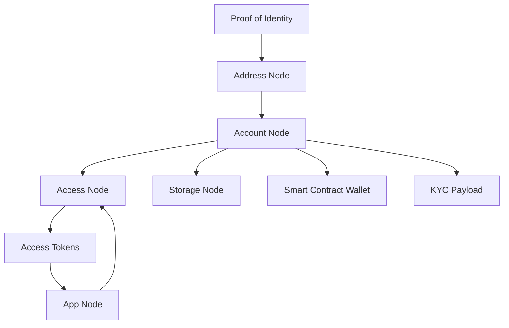

# How it works

### Overview

Rollup ID is designed to act as a "logically" or "sufficiently" decentralized user management platform that allows users to engage with online applications securely and privately. It aims to create simple on-boarding and off-boarding user experiences meeting not only regulatory and compliance requirements but also the needs and expectations of your users.

### Core: Open Source Profile Graph

At the core of the Rollup Platform is the open-source Profile Graph, deployed at the edge on Cloudflare's global infrastructure. The Profile Graph was inspired by the [W3C decentralized identifier specification](https://w3c.github.io/did-use-cases/). Instead of fully adopting the DID specification, Rollup ID utilizes familiar protocols like OAuth to provide a developer-friendly and user-centric platform that respects the goals of the DID spec:

* **Decentralized**: End users should be the issuers
* **Persistent**: Identifiers should be inherently persistent (and deterministic)
* **Cryptographically Verifiable**: It should be possible to prove control of the identifier
* **Resolvable**: It should be possible to discover metadata about the identifier

#### Main Features

* Based on the OAuth 2 and OpenID standards, enabling consent-based authorizations to services and data.
* Authorization tokens are issued by the user, providing full control and transparency into the authorizations.
* Authorization claims can allow access profile data such as, linked accounts, email addresses, PII/KYC data, smart contract wallets, and more.
* Protection from "fake accounts" with its identity verification features like passkeys and other MFA features.
* Designed to support custom claims to third-party services on the platform in the future.

### Edge-Deployed Profile Graph

Rollup ID is an open-source platform deployed at the edge, designed as a decentralized user graph consisting of nodes and edges. The nodes represent different types of objects, such as profiles, accounts, linked addresses, storage, smart contract wallets, applications, and authorizations. The edges represent the relationships between these nodes, enabling traversal and interaction within the graph.

#### Key Components

* **Nodes:** Nodes represent different types of objects in the graph, including profiles, accounts, linked addresses, storage, smart contract wallets, applications, and authorizations.
* **Edges:** Edges represent the relationships between nodes and are used to traverse and interact with the graph.
* **Access Tokens:** Users issue access tokens through claims and scopes to protect traversal of the graph.
* **Entry Node:** To traverse the graph, an entry node (e.g., subject) is typically required.
* **Uniform Resource Names (URN):** URNs, as defined in [RFC 8141](https://www.rfc-editor.org/rfc/rfc8141), are used in the profile graph to resolve nodes on the graph.

#### Accessing the Graph

1. **Proof of Identity:** To log in to Rollup, a user needs to present proof of identity, such as an email address or social account. This proof enables the deterministic discovery of the Address Node on the graph, representing the unique identity factor.
2. **Address Node and Account Node:** If the Address Node has a linked unique identity (Account Node), the graph can be traversed to this identity. If no identity exsists, one will be created.
3. **Authorization Claims:** The user's identity can now be asked to issue authorization claims to traverse other edges to nodes on the graph (e.g., profiles, storage namespaces, etc.). Once authorization is accepted, the authorization itself becomes an Access Node, linking the identity on one side to the application that requested the authorization on the other using edges.
4. **Access Node and Galaxy API:** The Access Node can be deterministically found on the graph using the access token, validating the claims on subsequent requests and allowing the developer to query the graph using the Galaxy API. Learn more about Galaxy [here](platform/profile-graph.md).

