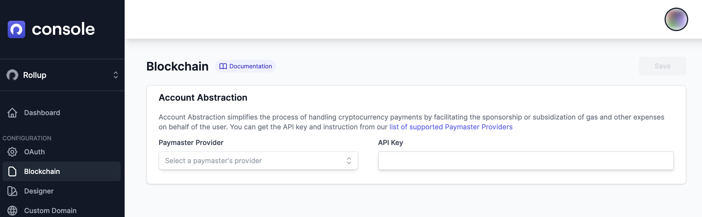
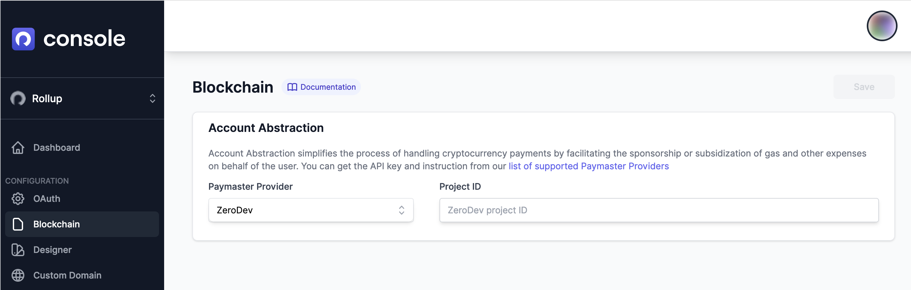

# Blockchain


This feature is in Early Access. [Login](https://console.rollup.id) to console and create an app to request access.


### Onboard users to blockchain

Ethereum account abstraction and user deposit vault accounts provide secure and flexible management of funds on the Ethereum blockchain. With this feature, apps can sponsor gas fees can interact with a smart contract wallet using the Galaxy API, while each user's funds are kept in a separate deposit vault account, reducing the risk of unauthorized access or loss of funds.

We help you integrate Paymaster Providers to your app, so you can onboard users to blockchain with a few clicks.

### To get started

Make sure you configured `erc_4337` scope in your app's [OAuth settings](oauth.md).

Then head over to the **Blockchain** tab in the console, once you've created an app.

Currently we support only one Paymaster Provider, **ZeroDev**, so you'll need to create a projectID in their system. You can easily do it [here](https://dashboard.zerodev.app/).

Next, set your projectID in the input field. Hit **Save** and you're ready to go!
