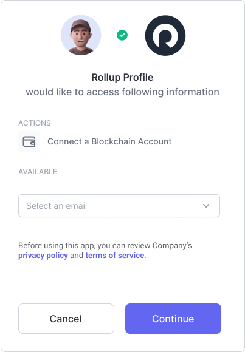

# OAuth

The OAuth tab is where you can configure your applications standard OAuth settings including the name and logo that will appear in the [Passport](../passport.md) flow for your users.

This is the most important configuration in this tab is the [Scopes](../../reference/scopes.md). Every scope is represents an authorization request that will be presented to the user during the auth flow in Passport. These authorizations include access to profile information, connected accounts, provisioning wallets and more.

<figure><figcaption>
OAuth Config Screen
</figcaption></figure>

### Settings Panel

<figure><figcaption>
OAuth Settings Panel
</figcaption></figure>

The settings panel is a read only configuration for your application's **Client ID** (aka App ID) and **Client Secret** (aka App Secret).&#x20;

These two keys are important for [logging in your users](../../getting-started/auth-flow.md).&#x20;


Here you can roll your your app's client secret but make sure to update this value in your app to ensure users can continue to login.


### Details Panel

<figure><figcaption>
OAuth App Details Panel
</figcaption></figure>

The details panel is where you configure your application name, picture, [authorization scopes](../../reference/scopes.md), [custom domain](custom-domain.md), and other links.

The name and picture you choose will be displayed to users when logging in.&#x20;

The authorization scopes, "privacy policy" and "terms of services" will be displayed to the user during the authorization step.

### Links Panel

<figure><figcaption>
Links Panel
</figcaption></figure>

The links panel is where you can add additional links about your apps that can be displayed to users in the Rollup apps directory.

### Danger Zone Panel

<figure><figcaption>
Danger Zone Panel
</figcaption></figure>

This is where you can delete your application.
