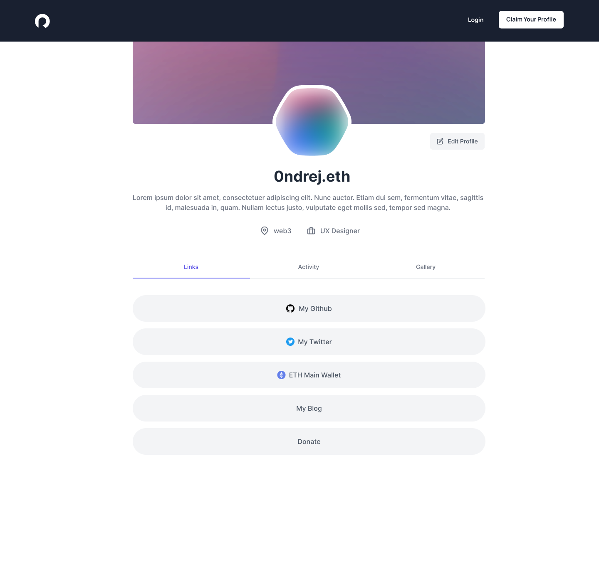

# Profile

Profile is a first-party [Profile Graph](profile-graph.md) powered application meaning it is also a great reference for all the things you can also do within your app with Rollup and [Scopes](../reference/scopes.md).&#x20;

### Profile Settings

Settings is where you manage your user profile. To help make managing your profile easy the settings is split into the following areas.

#### Dashboard

An overview of your profile including active authorized sessions.

<figure><figcaption></figcaption></figure>

#### NFT Gallery

Curate your NFT gallery for your public Profile

<figure><figcaption></figcaption></figure>

 

<figure><figcaption></figcaption></figure>

#### Apps (coming soon)

Manage your active sessions

#### Settings

The settings tab is where you manage your connected accounts and public profile:

**Profile**

Update your public profile fields.

<figure><figcaption></figcaption></figure>

**Links**

Manage your "[linktree](https://linktr.ee/)"-link settings. This includes which connected account you want to make publicly visible.

<figure><figcaption></figcaption></figure>

**Accounts**

Connect and disconnect accounts linked to your profile. Like DNS records, when accounts are made public they act as resolvers to your profile.

In this section you can also give nicknames to your hard to remember accounts like Ethereum accounts.


Disconnecting all your accounts is the equivalent to deleting your profile.


<figure><figcaption></figcaption></figure>

### Public Profile

The public profile is a way for you to choose how you would like to share your profile with the world.  This profile will be reachable by any of your connected account usernames.  In the future you will be allowed to select a primary handle.

For example, [https://my.rollup.id/0ndrej.eth](https://my.rollup.id/0ndrej.eth)

### Links

Links you would like to advertise on your public profile. You can add, sort, and remove links in this section including marking linked accounts as private or public.

<figure><figcaption></figcaption></figure>

 

<figure><figcaption></figcaption></figure>

### Activity

Coming soon

### Gallery

Your published NFT gallery.

<figure><figcaption></figcaption></figure>

 

<figure><figcaption></figcaption></figure>

